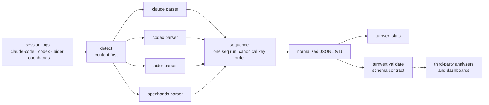

# turnvert

[English](README.md) | [中文](README.zh.md) | [日本語](README.ja.md)

[](LICENSE)   [](CONTRIBUTING.md)

**AI コーディングエージェントのセッションログのためのオープンソース正規化レイヤー——Claude Code・Codex・Aider・OpenHands の履歴を、ドキュメント化された単一の JSONL スキーマへ変換。オフライン動作・依存ゼロ。**


```bash
# not yet on npm — install from a checkout of this repository
npm install && npm run build && npm pack
npm install -g ./turnvert-0.1.0.tgz
```

## なぜ turnvert？

コーディングエージェントの上にツールを作るチームは、結局同じ 4 種類のログパーサーを書き直すことになります。Claude Code は `~/.claude/projects/` 配下に JSONL を保存し、ツール結果は user メッセージの中に紛れ込む。Codex は `rollout-*.jsonl` エンベロープを書き、シェル出力は終了コードごと JSON 文字列の中に埋まる。Aider は `.aider.chat.history.md` に Markdown を追記し、OpenHands はすべてを cause で結ばれた action/observation レコードに分解する。`claude-code-log` のような単一ハーネス向けビューアは 1 種類だけを美しく描画して終わりですし、OpenTelemetry の GenAI 計装は実行*前に*計装を仕込んだセッションしか見えません。turnvert はその欠けた中間層です：内容優先の検出器、90 本のテストで固定した 4 つのパーサー、そして小さくドキュメント化されたイベントスキーマ（`session_start`・`message`・`tool_call`・`tool_result`・`note`）に、他のツールが自分の出力へ実行できるバリデーターを添えて——アナライザーもダッシュボードも採点器も、一度書けば全ハーネスのログ（すでにディスクにあるものも含めて）で動きます。

|  | turnvert | claude-code-log | OTel GenAI トレーシング | 手書きパーサー |
|---|---|---|---|---|
| ハーネス対応 | 4 つ（Claude Code・Codex・Aider・OpenHands） | 1 つ | 計装済みアプリのみ | 都度 1 つずつ再実装 |
| ディスク上の既存ログを処理 | 可 | 可 | 不可——実行時計装が必要 | 可 |
| 出力 | ドキュメント化された JSONL スキーマ + JSON Schema | HTML トランスクリプト | collector への OTLP スパン | 場当たり的 |
| サードパーティ向けスキーマバリデーター | あり（`turnvert validate`） | なし | 該当なし | なし |
| ツール呼び出しと結果の対応付け | 4 ハーネス共通の `tool.id` | Claude のみ | span link | ハーネスごとに実装 |
| ランタイムの重さ | Node、依存 0 | Python パッケージ + 依存 | SDK + collector | — |

<sub>各機能の主張は 2026-07 時点の各プロジェクト公開ドキュメントで確認。</sub>

## 特長

- **4 ハーネスに 1 つのスキーマ** —— Claude Code・Codex CLI・Aider・OpenHands のログがすべて同じ 5 種類のイベントになり、フィールド単位の仕様は [docs/schema.md](docs/schema.md) に。
- **内容優先の自動検出** —— ファイル自身の構造がハーネスを決める。リネーム・コピーされたログも分類でき、ファイル名は同点決着にだけ使う（`turnvert detect` が判定を表示）。
- **他者が依拠できるバリデーター** —— `turnvert validate` は任意の JSONL をスキーマに照らして行番号付きエラーで検査し、`turnvert schema` は JSON Schema を出力。サードパーティ生産者にはオープンな `harness` 集合と `x_` 拡張プレフィックスを用意。
- **誠実な正規化** —— タイムスタンプを捏造せず（Aider のターンは `ts: null`）、トークン数を 0 で埋めず、usage はモデル応答ごとに 1 イベントへだけ付くので合計が二重計上にならない。
- **全イベントに出所** —— `source.file`・`source.line`・ハーネス固有 id が元ログを指し返し、下流の分析結果は常に監査可能。
- **決定的な出力** —— 固定キー順と安定した連番により、変換は実行間でバイト単位に一致。正規化ログの diff に意味が生まれる。
- **ランタイム依存ゼロ・完全オフライン** —— 必要なのは Node.js だけ。turnvert はローカルファイルを読み書きし、ソケットを一切開かない。devDependency は `typescript` のみ。

## クイックスタート

インストールしたら、任意のセッションログに `convert` を向けるだけ（自動検出、`--harness` で強制指定可）：

```bash
turnvert convert examples/codex-rollout.jsonl
```

出力（実際の実行結果、全 6 行のうち 3–6 行目）：

```text
{"v":1,"seq":3,"event":"message","ts":"2026-07-06T14:02:11.531Z","harness":"codex","session":"0198f3f2-77aa-7cc3-b1e4-55d20a9c31fb","role":"user","text":"The /orders endpoint returns 429 for every request after deploy. Find out why.","source":{"file":"examples/codex-rollout.jsonl","line":3}}
{"v":1,"seq":4,"event":"tool_call","ts":"2026-07-06T14:02:14.910Z","harness":"codex","session":"0198f3f2-77aa-7cc3-b1e4-55d20a9c31fb","thinking":"A blanket 429 right after deploy smells like a rate limiter misconfiguration; check the middleware defaults first.","tool":{"id":"call_9kQ2mRt7Lw1","name":"shell","input":{"command":["grep","-rn","rateLimit","src/middleware"],"timeout_ms":10000}},"source":{"file":"examples/codex-rollout.jsonl","line":5,"id":"call_9kQ2mRt7Lw1"}}
{"v":1,"seq":5,"event":"tool_result","ts":"2026-07-06T14:02:15.204Z","harness":"codex","session":"0198f3f2-77aa-7cc3-b1e4-55d20a9c31fb","tool":{"id":"call_9kQ2mRt7Lw1","output":"src/middleware/limits.js:12:  rateLimit({ windowMs: 60000, max: 0 })\n","error":false},"source":{"file":"examples/codex-rollout.jsonl","line":6,"id":"call_9kQ2mRt7Lw1"}}
{"v":1,"seq":6,"event":"message","ts":"2026-07-06T14:02:18.771Z","harness":"codex","session":"0198f3f2-77aa-7cc3-b1e4-55d20a9c31fb","role":"assistant","model":"gpt-5-codex","text":"Found it: `max: 0` in src/middleware/limits.js:12 means zero requests are allowed per window. The deploy picked up an unset RATE_LIMIT_MAX env var that defaults to 0. Set the default to a positive number or export the variable.","usage":{"input":3090,"output":128,"cache_read":2048},"source":{"file":"examples/codex-rollout.jsonl","line":7}}
```

続いて 4 ハーネスを 1 本のストリームへ統合し、検証して集計（実際の実行結果）：

```bash
turnvert convert examples/*.jsonl examples/*-history.md examples/*.json --out all.jsonl
turnvert validate all.jsonl
turnvert stats all.jsonl
```

```text
OK: 40 event(s), 5 session(s)
SESSION                       HARNESS      EVENTS  MSGS  TOOLS  ERRS  TOKENS IN/OUT
9f8f61c2-4a2e-4bfa-9e5d-1c9…  claude-code  9       3     2      0     9273/268
0198f3f2-77aa-7cc3-b1e4-55d…  codex        6       3     1      0     3090/128
aider-2026-07-04T18:22:05     aider        13      4     0      0     5500/560
aider-2026-07-04T19:05:41     aider        3       1     0      0     0/0
openhands-events              openhands    9       3     2      0     0/0

40 event(s) across 5 session(s)
```

ハーネスごとのサンプルログは [examples/](examples/README.md) に、ハーネス別のマッピング表は [docs/harnesses.md](docs/harnesses.md) にあります。

## イベントスキーマ

5 種類のイベント、1 行 1 JSON オブジェクト、`seq` はちょうど 1 ずつ増加。完全な仕様は [docs/schema.md](docs/schema.md)、`turnvert schema` が機械可読の JSON Schema を出力します。

| `event` | 保持するもの | 意味 |
|---|---|---|
| `session_start` | `meta`（cwd・version・model・branch など） | セッションごとに 1 つ、常に先頭 |
| `message` | `role`・`text`・`thinking`・`model`・`usage` | ユーザーの発話、アシスタントの返答、システムプロンプト |
| `tool_call` | `tool.id`・`tool.name`・`tool.input`・`thinking` | ツール/関数/シェル呼び出し、OpenHands の action |
| `tool_result` | `tool.id`・`tool.output`・`tool.error` | 出力。`tool.id` で呼び出しと対応付け |
| `note` | `text`、ときに `usage` | ハーネスの雑務：要約、適用済み編集、コミット、状態変化 |

組み込み 4 種以外の生産者も歓迎です：`harness` はオープン集合、未知のトップレベルキーは拒否されますが、*例外として* `x_` 拡張プレフィックスは予約済み。`turnvert validate` が適合性テストです。

## `turnvert` CLI

| コマンド | 役割 | 終了コード |
|---|---|---|
| `convert` | ログを JSONL へ正規化（`--harness`・`--out`・`--raw`・`--strict`） | 0。読めない/判別不能な入力は 1 |
| `detect` | 各入力のハーネスを報告 | 0。不明な入力があれば 1 |
| `stats` | セッション別の表または `--format json`。正規化済み JSONL も直接読める | 0 / 1 / 2 |
| `validate` | 正規化 JSONL を検査、エラーは行番号付き | 0 有効 / 1 無効 / 2 読めない |
| `schema` | イベント 1 件分の JSON Schema を出力 | 0 |

ディレクトリは OpenHands の `events/` フォルダ（`<id>.json` ファイル群）として扱われます。パースの問題は既定で stderr への警告になり、`--strict` で終了コード 1 に昇格します。

## アーキテクチャ



## ロードマップ

- [x] スキーマ v1 + 4 パーサー、内容優先検出、convert/detect/stats/validate/schema CLI、JSON Schema、出所記録、決定的出力（v0.1.0）
- [ ] Edit/apply_patch/edit ツール呼び出しから再構成する派生 `file_change` イベント
- [ ] 数 GB 級ログのストリーミング変換（1 行ずつ、メモリ一定）
- [ ] 同じスキーマの下でさらに多くのハーネス（Gemini CLI・Cline）のパーサー
- [ ] 適合性コーパス：ソース→正規化のゴールデンペアをサードパーティのパーサー検証用に

全リストは [open issues](https://github.com/JaydenCJ/turnvert/issues) を参照。

## コントリビュート

コントリビュート歓迎です。`npm install && npm run build` でビルドし、`npm test` と `bash scripts/smoke.sh`（`SMOKE OK` の出力が必須）を実行してください——このリポジトリは CI を持たず、上記の主張はすべてローカル実行で検証されています。[CONTRIBUTING.md](CONTRIBUTING.md) を読み、[good first issue](https://github.com/JaydenCJ/turnvert/issues?q=is%3Aissue+is%3Aopen+label%3A%22good+first+issue%22) を選ぶか、[discussion](https://github.com/JaydenCJ/turnvert/discussions) を始めてください。

## ライセンス

[MIT](LICENSE)
