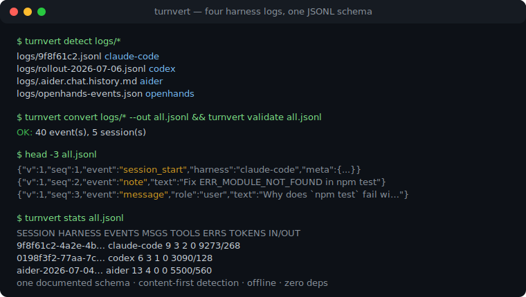
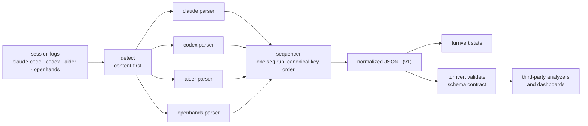

# turnvert

[English](README.md) | [中文](README.zh.md) | [日本語](README.ja.md)

[](LICENSE)   [](CONTRIBUTING.md)

**An open-source normalization layer for AI coding-agent session logs — converts Claude Code, Codex, Aider and OpenHands histories into one documented JSONL schema, offline and dependency-free.**



```bash
# not yet on npm — install from a checkout of this repository
npm install && npm run build && npm pack
npm install -g ./turnvert-0.1.0.tgz
```

## Why turnvert?

Every team building on top of coding agents ends up writing the same four log parsers. Claude Code keeps JSONL under `~/.claude/projects/` with tool results smuggled inside user messages; Codex writes `rollout-*.jsonl` envelopes where shell output hides in a JSON string with an exit code; Aider appends Markdown to `.aider.chat.history.md`; OpenHands splits everything into cause-linked action/observation records. Per-harness viewers such as `claude-code-log` render exactly one of these beautifully and stop there, and OpenTelemetry GenAI instrumentation only sees sessions you remembered to instrument *before* running them. turnvert is the missing middle layer: a content-first detector, four parsers pinned by 90 tests, and one small, documented event schema (`session_start`, `message`, `tool_call`, `tool_result`, `note`) with a validator other tools can run against their own output — so an analyzer, dashboard or grader written once works on logs from every harness, including the ones already sitting on disk.

|  | turnvert | claude-code-log | OTel GenAI tracing | DIY parsers |
|---|---|---|---|---|
| Harness coverage | 4 (Claude Code, Codex, Aider, OpenHands) | 1 | only instrumented apps | one per rewrite |
| Works on logs already on disk | yes | yes | no — needs runtime instrumentation | yes |
| Output | documented JSONL schema + JSON Schema | HTML transcripts | OTLP spans to a collector | ad-hoc |
| Schema validator for third parties | yes (`turnvert validate`) | no | n/a | no |
| Tool call ↔ result correlation | normalized `tool.id` across all four | Claude-only | span links | per-harness code |
| Runtime footprint | Node, 0 dependencies | Python package + deps | SDK + collector | — |

<sub>Capability claims checked against each project's public documentation, 2026-07.</sub>

## Features

- **One schema for four harnesses** — Claude Code, Codex CLI, Aider and OpenHands logs all come out as the same five event kinds, specified field-by-field in [docs/schema.md](docs/schema.md).
- **Content-first auto-detection** — the file's own structure decides its harness; renamed or copied logs still classify, and filenames only break ties (`turnvert detect` shows the verdict).
- **A validator others can build against** — `turnvert validate` checks any JSONL against the schema with line-addressed errors, and `turnvert schema` prints the JSON Schema; third-party producers get an open `harness` set and an `x_` extension prefix.
- **Honest normalization** — no invented timestamps (Aider turns are `ts: null`), no zero-filled token counts, and usage attaches to exactly one event per model response so sums never double-count.
- **Provenance on every event** — `source.file`, `source.line` and the harness-native id point back into the original log, so downstream findings stay auditable.
- **Deterministic output** — fixed key order and stable sequencing make conversion byte-identical across runs; diffs of normalized logs mean something.
- **Zero runtime dependencies, fully offline** — Node.js is the only requirement; turnvert reads local files, writes local files, and never opens a socket. `typescript` is the sole devDependency.

## Quickstart

Install, then point `convert` at any session log (auto-detected, `--harness` to force):

```bash
turnvert convert examples/codex-rollout.jsonl
```

Output (real captured run, lines 3–6 of 6):

```text
{"v":1,"seq":3,"event":"message","ts":"2026-07-06T14:02:11.531Z","harness":"codex","session":"0198f3f2-77aa-7cc3-b1e4-55d20a9c31fb","role":"user","text":"The /orders endpoint returns 429 for every request after deploy. Find out why.","source":{"file":"examples/codex-rollout.jsonl","line":3}}
{"v":1,"seq":4,"event":"tool_call","ts":"2026-07-06T14:02:14.910Z","harness":"codex","session":"0198f3f2-77aa-7cc3-b1e4-55d20a9c31fb","thinking":"A blanket 429 right after deploy smells like a rate limiter misconfiguration; check the middleware defaults first.","tool":{"id":"call_9kQ2mRt7Lw1","name":"shell","input":{"command":["grep","-rn","rateLimit","src/middleware"],"timeout_ms":10000}},"source":{"file":"examples/codex-rollout.jsonl","line":5,"id":"call_9kQ2mRt7Lw1"}}
{"v":1,"seq":5,"event":"tool_result","ts":"2026-07-06T14:02:15.204Z","harness":"codex","session":"0198f3f2-77aa-7cc3-b1e4-55d20a9c31fb","tool":{"id":"call_9kQ2mRt7Lw1","output":"src/middleware/limits.js:12:  rateLimit({ windowMs: 60000, max: 0 })\n","error":false},"source":{"file":"examples/codex-rollout.jsonl","line":6,"id":"call_9kQ2mRt7Lw1"}}
{"v":1,"seq":6,"event":"message","ts":"2026-07-06T14:02:18.771Z","harness":"codex","session":"0198f3f2-77aa-7cc3-b1e4-55d20a9c31fb","role":"assistant","model":"gpt-5-codex","text":"Found it: `max: 0` in src/middleware/limits.js:12 means zero requests are allowed per window. The deploy picked up an unset RATE_LIMIT_MAX env var that defaults to 0. Set the default to a positive number or export the variable.","usage":{"input":3090,"output":128,"cache_read":2048},"source":{"file":"examples/codex-rollout.jsonl","line":7}}
```

Now merge all four harnesses into one stream, validate it, and summarize it (real captured run):

```bash
turnvert convert examples/*.jsonl examples/*-history.md examples/*.json --out all.jsonl
turnvert validate all.jsonl
turnvert stats all.jsonl
```

```text
OK: 40 event(s), 5 session(s)
SESSION                       HARNESS      EVENTS  MSGS  TOOLS  ERRS  TOKENS IN/OUT
9f8f61c2-4a2e-4bfa-9e5d-1c9…  claude-code  9       3     2      0     9273/268
0198f3f2-77aa-7cc3-b1e4-55d…  codex        6       3     1      0     3090/128
aider-2026-07-04T18:22:05     aider        13      4     0      0     5500/560
aider-2026-07-04T19:05:41     aider        3       1     0      0     0/0
openhands-events              openhands    9       3     2      0     0/0

40 event(s) across 5 session(s)
```

One log per harness ships in [examples/](examples/README.md); the per-harness mapping tables live in [docs/harnesses.md](docs/harnesses.md).

## The event schema

Five event kinds, one JSON object per line, `seq` incrementing by exactly 1. Full specification in [docs/schema.md](docs/schema.md); `turnvert schema` prints the machine-readable JSON Schema.

| `event` | Carries | Meaning |
|---|---|---|
| `session_start` | `meta` (cwd, version, model, branch, …) | one per session, always first |
| `message` | `role`, `text`, `thinking`, `model`, `usage` | user prompts, assistant replies, system prompts |
| `tool_call` | `tool.id`, `tool.name`, `tool.input`, `thinking` | tool/function/shell invocations, OpenHands actions |
| `tool_result` | `tool.id`, `tool.output`, `tool.error` | outputs, correlated to calls via `tool.id` |
| `note` | `text`, sometimes `usage` | harness housekeeping: summaries, applied edits, commits, state changes |

Producers beyond the built-in four are welcome: `harness` is an open set, unknown top-level keys are rejected *except* the reserved `x_` extension prefix, and `turnvert validate` is the conformance test.

## The `turnvert` CLI

| Command | Does | Exit codes |
|---|---|---|
| `convert` | normalize logs to JSONL (`--harness`, `--out`, `--raw`, `--strict`) | 0, or 1 on unreadable/undetectable inputs |
| `detect` | report the harness of each input | 0, or 1 if any input is unknown |
| `stats` | per-session table or `--format json`; also consumes normalized JSONL | 0 / 1 / 2 |
| `validate` | check a normalized JSONL file, line-addressed errors | 0 valid / 1 invalid / 2 unreadable |
| `schema` | print the JSON Schema for one event | 0 |

Directories are treated as OpenHands `events/` folders of `<id>.json` files. Parse problems are warnings on stderr by default; `--strict` turns them into exit 1.

## Architecture



## Roadmap

- [x] Schema v1 + four parsers, content-first detection, convert/detect/stats/validate/schema CLI, JSON Schema, provenance, deterministic output (v0.1.0)
- [ ] Derived `file_change` events reconstructed from Edit/apply_patch/edit tool calls
- [ ] Streaming conversion for multi-gigabyte logs (line-at-a-time, constant memory)
- [ ] Parsers for more harnesses (Gemini CLI, Cline) behind the same schema
- [ ] A conformance corpus: golden source→normalized pairs third-party parsers can test against

See the [open issues](https://github.com/JaydenCJ/turnvert/issues) for the full list.

## Contributing

Contributions are welcome. Build with `npm install && npm run build`, then run `npm test` and `bash scripts/smoke.sh` (must print `SMOKE OK`) — this repository ships no CI, every claim above is verified by local runs. See [CONTRIBUTING.md](CONTRIBUTING.md), grab a [good first issue](https://github.com/JaydenCJ/turnvert/issues?q=is%3Aissue+is%3Aopen+label%3A%22good+first+issue%22), or start a [discussion](https://github.com/JaydenCJ/turnvert/discussions).

## License

[MIT](LICENSE)
