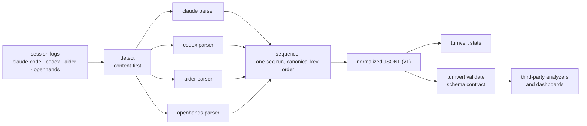

# turnvert

[English](README.md) | [中文](README.zh.md) | [日本語](README.ja.md)

[](LICENSE)   [](CONTRIBUTING.md)

**面向 AI 编码代理会话日志的开源归一化层——把 Claude Code、Codex、Aider 和 OpenHands 的历史记录转换成一套有文档的统一 JSONL schema，离线运行、零依赖。**


```bash
# not yet on npm — install from a checkout of this repository
npm install && npm run build && npm pack
npm install -g ./turnvert-0.1.0.tgz
```

## 为什么选 turnvert？

每个在编码代理之上构建工具的团队，最后都会把同样的四个日志解析器重写一遍。Claude Code 把 JSONL 存在 `~/.claude/projects/` 下，工具结果藏在 user 消息里；Codex 写 `rollout-*.jsonl` 信封，shell 输出连同退出码埋在一个 JSON 字符串中；Aider 往 `.aider.chat.history.md` 追加 Markdown；OpenHands 把一切拆成用 cause 关联的 action/observation 记录。像 `claude-code-log` 这样的单 harness 查看器只把其中一种渲染得很漂亮就止步了，而 OpenTelemetry GenAI 插桩只能看到你在运行*之前*记得插桩的会话。turnvert 补上了缺失的中间层：内容优先的检测器、四个由 90 个测试钉牢的解析器，以及一套小而有文档的事件 schema（`session_start`、`message`、`tool_call`、`tool_result`、`note`），并附带其他工具可以对自己输出运行的校验器——分析器、看板或评分器只需写一次，就能处理所有 harness 的日志，包括早已躺在磁盘上的那些。

|  | turnvert | claude-code-log | OTel GenAI 追踪 | 手写解析器 |
|---|---|---|---|---|
| Harness 覆盖 | 4 个（Claude Code、Codex、Aider、OpenHands） | 1 个 | 仅限已插桩应用 | 每次重写一个 |
| 可处理磁盘上已有日志 | 是 | 是 | 否——需要运行时插桩 | 是 |
| 输出 | 有文档的 JSONL schema + JSON Schema | HTML 会话记录 | 发往 collector 的 OTLP span | 临时格式 |
| 供第三方使用的 schema 校验器 | 有（`turnvert validate`） | 无 | 不适用 | 无 |
| 工具调用与结果的关联 | 四个 harness 统一的 `tool.id` | 仅 Claude | span link | 每个 harness 单写 |
| 运行时占用 | Node，0 依赖 | Python 包 + 依赖 | SDK + collector | — |

<sub>各项能力均对照各项目 2026-07 的公开文档核实。</sub>

## 特性

- **四个 harness，一套 schema** —— Claude Code、Codex CLI、Aider 和 OpenHands 的日志都输出为同样的五种事件，逐字段规范见 [docs/schema.md](docs/schema.md)。
- **内容优先的自动检测** —— 由文件自身结构决定 harness；重命名或拷贝的日志照样能识别，文件名只用于打破平局（`turnvert detect` 给出判定）。
- **供他人构建的校验器** —— `turnvert validate` 按 schema 检查任意 JSONL 并给出带行号的错误，`turnvert schema` 打印 JSON Schema；第三方生产者拥有开放的 `harness` 集合和 `x_` 扩展前缀。
- **诚实的归一化** —— 不虚构时间戳（Aider 的回合是 `ts: null`），不用 0 填充 token 计数，usage 每个模型响应只挂到一个事件上，求和永不重复计数。
- **每个事件都带出处** —— `source.file`、`source.line` 和 harness 原生 id 指回原始日志，下游结论始终可审计。
- **确定性输出** —— 固定键序加稳定编号，让转换在多次运行间字节级一致；归一化日志的 diff 是有意义的。
- **零运行时依赖，完全离线** —— 只需要 Node.js；turnvert 读本地文件、写本地文件，从不打开 socket。`typescript` 是唯一的 devDependency。

## 快速上手

安装后把 `convert` 指向任意会话日志（自动检测，`--harness` 可强制指定）：

```bash
turnvert convert examples/codex-rollout.jsonl
```

输出（真实运行结果，共 6 行，这里是第 3–6 行）：

```text
{"v":1,"seq":3,"event":"message","ts":"2026-07-06T14:02:11.531Z","harness":"codex","session":"0198f3f2-77aa-7cc3-b1e4-55d20a9c31fb","role":"user","text":"The /orders endpoint returns 429 for every request after deploy. Find out why.","source":{"file":"examples/codex-rollout.jsonl","line":3}}
{"v":1,"seq":4,"event":"tool_call","ts":"2026-07-06T14:02:14.910Z","harness":"codex","session":"0198f3f2-77aa-7cc3-b1e4-55d20a9c31fb","thinking":"A blanket 429 right after deploy smells like a rate limiter misconfiguration; check the middleware defaults first.","tool":{"id":"call_9kQ2mRt7Lw1","name":"shell","input":{"command":["grep","-rn","rateLimit","src/middleware"],"timeout_ms":10000}},"source":{"file":"examples/codex-rollout.jsonl","line":5,"id":"call_9kQ2mRt7Lw1"}}
{"v":1,"seq":5,"event":"tool_result","ts":"2026-07-06T14:02:15.204Z","harness":"codex","session":"0198f3f2-77aa-7cc3-b1e4-55d20a9c31fb","tool":{"id":"call_9kQ2mRt7Lw1","output":"src/middleware/limits.js:12:  rateLimit({ windowMs: 60000, max: 0 })\n","error":false},"source":{"file":"examples/codex-rollout.jsonl","line":6,"id":"call_9kQ2mRt7Lw1"}}
{"v":1,"seq":6,"event":"message","ts":"2026-07-06T14:02:18.771Z","harness":"codex","session":"0198f3f2-77aa-7cc3-b1e4-55d20a9c31fb","role":"assistant","model":"gpt-5-codex","text":"Found it: `max: 0` in src/middleware/limits.js:12 means zero requests are allowed per window. The deploy picked up an unset RATE_LIMIT_MAX env var that defaults to 0. Set the default to a positive number or export the variable.","usage":{"input":3090,"output":128,"cache_read":2048},"source":{"file":"examples/codex-rollout.jsonl","line":7}}
```

接着把四个 harness 合并成一条流，校验并汇总（真实运行结果）：

```bash
turnvert convert examples/*.jsonl examples/*-history.md examples/*.json --out all.jsonl
turnvert validate all.jsonl
turnvert stats all.jsonl
```

```text
OK: 40 event(s), 5 session(s)
SESSION                       HARNESS      EVENTS  MSGS  TOOLS  ERRS  TOKENS IN/OUT
9f8f61c2-4a2e-4bfa-9e5d-1c9…  claude-code  9       3     2      0     9273/268
0198f3f2-77aa-7cc3-b1e4-55d…  codex        6       3     1      0     3090/128
aider-2026-07-04T18:22:05     aider        13      4     0      0     5500/560
aider-2026-07-04T19:05:41     aider        3       1     0      0     0/0
openhands-events              openhands    9       3     2      0     0/0

40 event(s) across 5 session(s)
```

每个 harness 各附一份示例日志，见 [examples/](examples/README.md)；逐 harness 的映射表在 [docs/harnesses.md](docs/harnesses.md)。

## 事件 schema

五种事件，每行一个 JSON 对象，`seq` 严格加 1 递增。完整规范见 [docs/schema.md](docs/schema.md)；`turnvert schema` 打印机器可读的 JSON Schema。

| `event` | 携带 | 含义 |
|---|---|---|
| `session_start` | `meta`（cwd、version、model、branch 等） | 每会话一个，永远在最前 |
| `message` | `role`、`text`、`thinking`、`model`、`usage` | 用户提问、助手回复、系统提示 |
| `tool_call` | `tool.id`、`tool.name`、`tool.input`、`thinking` | 工具/函数/shell 调用，OpenHands 的 action |
| `tool_result` | `tool.id`、`tool.output`、`tool.error` | 输出，通过 `tool.id` 与调用关联 |
| `note` | `text`，有时带 `usage` | harness 杂务：摘要、已应用的编辑、提交、状态变化 |

欢迎内置四家之外的生产者：`harness` 是开放集合，未知顶层键会被拒绝，*但*保留 `x_` 扩展前缀，`turnvert validate` 就是一致性测试。

## `turnvert` 命令行

| 命令 | 作用 | 退出码 |
|---|---|---|
| `convert` | 把日志归一化为 JSONL（`--harness`、`--out`、`--raw`、`--strict`） | 0；输入不可读/无法识别时为 1 |
| `detect` | 报告每个输入的 harness | 0；任一输入未知时为 1 |
| `stats` | 按会话输出表格或 `--format json`；也可直接读归一化 JSONL | 0 / 1 / 2 |
| `validate` | 校验归一化 JSONL 文件，错误带行号 | 0 有效 / 1 无效 / 2 不可读 |
| `schema` | 打印单个事件的 JSON Schema | 0 |

目录会被当作 OpenHands 的 `events/` 文件夹（`<id>.json` 文件）。解析问题默认作为警告写到 stderr；`--strict` 会把它们变成退出码 1。

## 架构



## 路线图

- [x] Schema v1 + 四个解析器、内容优先检测、convert/detect/stats/validate/schema 命令、JSON Schema、出处标注、确定性输出（v0.1.0）
- [ ] 从 Edit/apply_patch/edit 工具调用重建派生的 `file_change` 事件
- [ ] 面向数 GB 日志的流式转换（逐行处理、常量内存）
- [ ] 在同一 schema 下支持更多 harness（Gemini CLI、Cline）的解析器
- [ ] 一致性语料库：源日志→归一化结果的黄金样本对，供第三方解析器测试

完整列表见 [open issues](https://github.com/JaydenCJ/turnvert/issues)。

## 参与贡献

欢迎贡献。先 `npm install && npm run build` 构建，再运行 `npm test` 和 `bash scripts/smoke.sh`（必须打印 `SMOKE OK`）——本仓库不带 CI，以上所有断言都靠本地运行验证。参阅 [CONTRIBUTING.md](CONTRIBUTING.md)，认领一个 [good first issue](https://github.com/JaydenCJ/turnvert/issues?q=is%3Aissue+is%3Aopen+label%3A%22good+first+issue%22)，或发起 [discussion](https://github.com/JaydenCJ/turnvert/discussions)。

## 许可证

[MIT](LICENSE)
